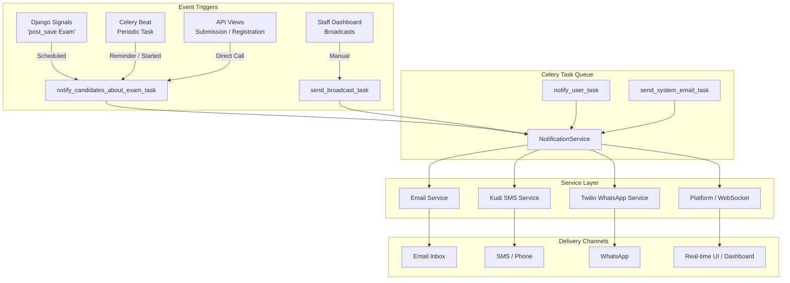

# Candidate Notification Flow

This document outlines how notifications are triggered, processed, and delivered to candidates within the VMLC platform.

## Notification Architecture

The system uses a decoupled architecture where events trigger asynchronous tasks, which then utilize a central service to dispatch messages across multiple channels.

## Key Notification Events

### 1. Exam Lifecycle
| Event | Trigger Source | Timing | Mediums |
| :--- | :--- | :--- | :--- |
| **Exam Scheduled** | `Exam` post_save Signal | Immediate upon creation | Email, Platform, SMS, WhatsApp |
| **Passcode Delivery** | `generate_and_send_exam_passcodes_task` | When passcodes are generated | Email |
| **Exam Reminder** | `check_exam_status_transitions_task` | 1 hour before start | Email, Platform, SMS, WhatsApp |
| **Exam Started** | `check_exam_status_transitions_task` | At scheduled start time | Email, Platform, SMS, WhatsApp |
| **Submission Successful** | `SubmitAnswersView` (API) | Immediately after submission | Email, Platform, SMS |

### 2. Identity & Onboarding
| Event | Trigger Source | Timing | Mediums |
| :--- | :--- | :--- | :--- |
| **Pre-reg Welcome** | `Registration` (API) | Immediate | Email |
| **Registration OTP** | `User` creation | During sign-up | Email |
| **Full-reg Welcome** | `User` activation | After verification | Email |
| **Registration Opening** | `notify_prereg_users_via_whatsapp_task` | Manual or Automated | WhatsApp |

### 3. Support & Communication
| Event | Trigger Source | Timing | Mediums |
| :--- | :--- | :--- | :--- |
| **Support Confirmation** | `PublicSupportRequest` (API) | Immediate | Email |
| **Broadcast Messages** | Staff Admin Action | Manual | Multi-channel (Customizable) |

## Delivery Flow Details

1.  **Platform (Real-time):**
    -   A `Notification` record is created in the database.
    -   The message is pushed to the candidate's browser via **Django Channels (WebSockets)** using a group name based on the user ID (`user__{id}`).
    -   Cache for the user's notification list is invalidated.

2.  **Email:**
    -   Dispatched via `send_mail` or `send_mass_mail` tasks.
    -   Uses SMTP configuration (standard email delivery).

3.  **SMS:**
    -   Routed through the **Kudi SMS** gateway.
    -   Tasks check for sufficient balance before sending; alerts are sent to Slack if balance is low.

4.  **WhatsApp:**
    -   Delivered via the **Twilio API**.
    -   Requires the candidate's phone number to be in E.164 format.
