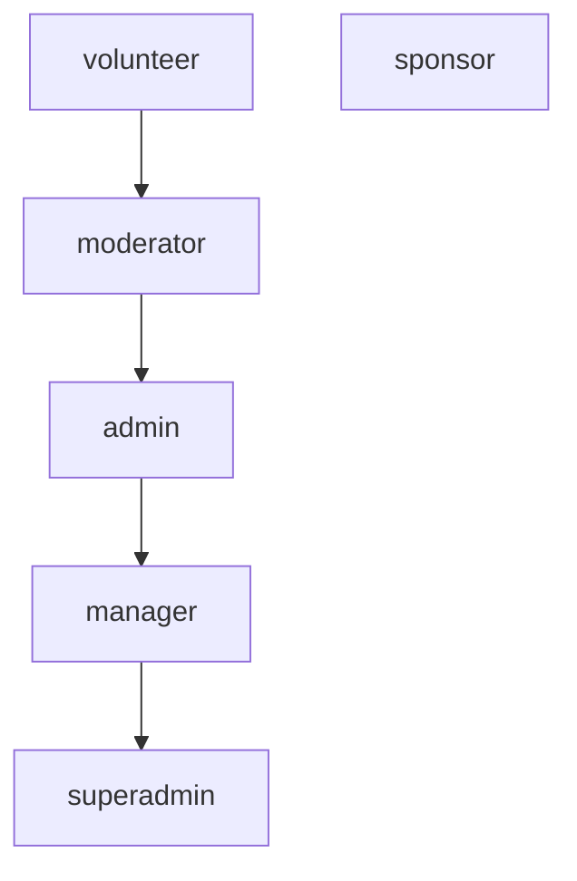

# Staff Roles

Staff members have hierarchical roles with cumulative permissions.

## Role: Volunteer

**Entry-level** staff role.

### Abilities
- View own profile
- Submit documents for verification

### Accessible Endpoints
- `GET /staff/me/`
- `GET /user/verification/status/`
- `POST /user/verification/upload/`

## Role: Moderator

**Content management** role.

### Additional Abilities
- View candidate details
- Full question management (CRUD)
- View leaderboards

### Additional Endpoints
- `GET /candidates/`
- `GET /questions/`
- `POST /questions/`
- `PUT/PATCH/DELETE /questions/{id}/`

## Role: Admin

**Exam and scoring** management.

### Additional Abilities
- View detailed candidate information
- Change candidate roles
- Full exam management (CRUD)
- Manual score submission
- Publish leaderboards

### Additional Endpoints
- `GET /candidates/{id}/`
- `GET /candidates/{id}/scores/`
- `PUT /candidates/{id}/roles/assign/`
- `GET/POST /exams/`
- `PUT/PATCH/DELETE /exams/{id}/`
- `PUT /exams/{id}/submit-exam-score/`
- `POST /leaderboard/publish/`

## Role: Manager

**User verification and staff** management.

### Additional Abilities
- View staff member details
- Change staff roles (except manager/superadmin)
- Manage user verifications (approve/reject)
- Create broadcasts

### Additional Endpoints
- `GET /staff/`
- `GET /staff/{id}/`
- `PUT /staff/{id}/roles/assign/`
- `GET /user/verification/list/`
- `POST /user/verification/action/{id}/`
- `GET/POST /broadcasts/`

## Role: Superadmin

**Full platform** control.

### Additional Abilities
- Assign any staff role (except superadmin)
- Complete system access
- No restrictions

### Permissions
- Inherits all manager permissions
- Can perform any action except creating other superadmins

## Role: Sponsor

**Honorary role** with no specific permissions.

## Permission Hierarchy

*Higher roles inherit all permissions from lower roles.*
