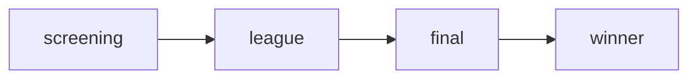

# Candidate Roles

Candidates progress through four roles as they advance in the competition.

## Role: Screening

**Initial role** assigned upon registration.

### Abilities

- View personal dashboard
- Take screening-level exams
- View own profile and verification status
- View screening leaderboard

### Accessible Endpoints

- `GET /dashboard/candidate/`
- `GET /candidates/me/`
- `GET /user/verification/status/`
- `POST /user/verification/upload/`
- `GET /exams/{id}/take-exam/` (screening exams only)
- `POST /exams/{id}/submit-exam-answers/`
- `GET /leaderboard/` (screening exams only)

## Role: League

**Progression** from screening after staff approval.

### Additional Abilities

- Take league-level exams
- View competition leaderboard
- Access more advanced content

### Additional Endpoints

- `GET /exams/{id}/take-exam/` (league exams)
- `GET /leaderboard/` (all exams)

## Role: Final

**Progression** to final stage of competition.

### Additional Abilities

- Access to final-stage exams
- Compete for top prizes

### Additional Endpoints

- `GET /exams/{id}/take-exam/` (final exams)

## Role: Winner

**Ceremonial role** for competition winners.

### Abilities

- All final role permissions
- Winner status recognition

## Role Progression

Staff with `admin` role or higher can promote candidates to the next role.
